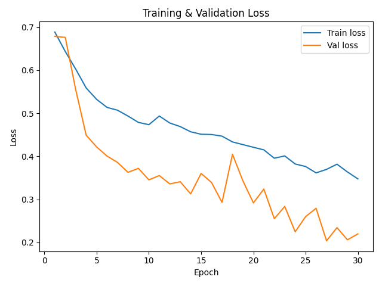
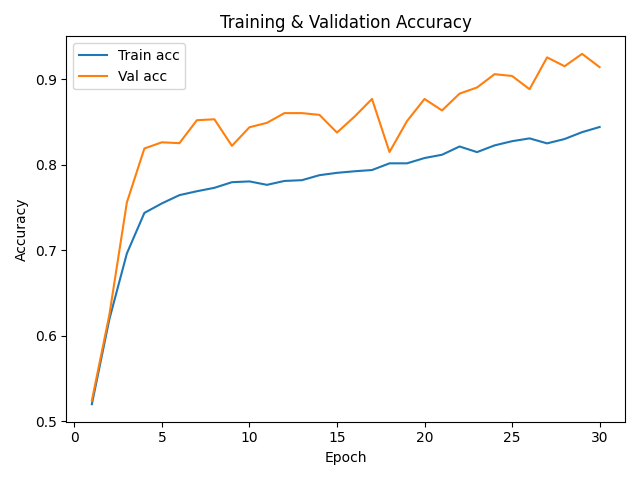
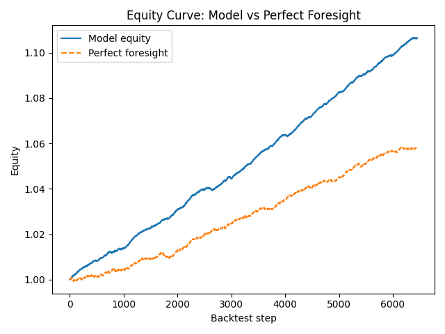
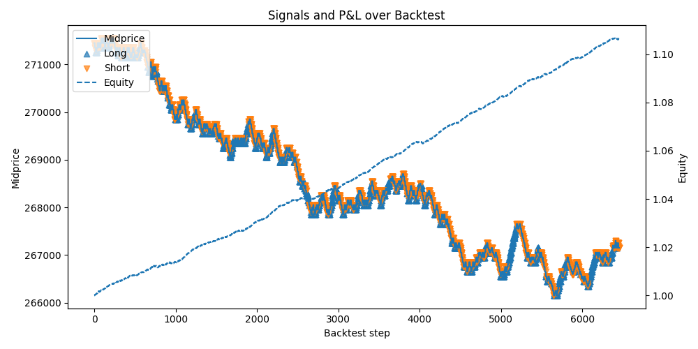

# LOB-LSTM Trading - Offline ML + Real-Time Streaming Pipeline

Deep learning–based intraday trading strategy on **limit order book (LOB)** data using an **LSTM model**.  
This project combines:
- **Offline ML research & backtesting** (Python, PyTorch)
- **Production-style streaming inference** using **Redis Streams**
- **Stateful online feature engineering**
- **Durable batch sinks (Parquet)**
- **Post-hoc analytics & calibration evaluation**

The result is a reproducible, end-to-end ML data pipeline that mirrors real-world
market data systems.
---

## Overview

This repository implements an end-to-end ML system for limit order book data.

### Offline ML
- Train an **LSTM** on NASDAQ **LOBSTER** data (INTC)
- Predict short-horizon **mid-price direction**
- Backtest a simple long/short strategy
- Track accuracy, loss, and equity vs. an upper-bound benchmark

### Streaming ML System
A production-style pipeline that:

- Replays historical LOB events into **Redis Streams**
- Maintains **stateful rolling feature windows** (100×4)
- Runs **real-time PyTorch inference**
- Publishes predictions back to Redis
- Writes results to **Parquet** in configurable batches
- Runs **offline analytics** to evaluate accuracy & calibration

### Details
- End-to-end Python pipeline:
  - Load & preprocess LOBSTER message/order book files
  - Compute order flow imbalance & midprice features
  - Build sequence inputs for an LSTM
  - Train & validate a classification model
  - Backtest a trading strategy based on model signals
- Performance tracking:
  - Train/validation loss & accuracy curves
  - Equity curve vs. a “perfect foresight” upper bound
  - Signals & PnL visualization

- Event Ingestion
   - Historical LOB data is replayed into Redis Streams
   - Simulates live market data while remaining fully reproducible

- Stateful Stream Processing
   - Maintains rolling feature windows per event
   - Produces model-ready (100 × 4) tensors in real time
   - Demonstrates online feature engineering (not batch)

- Real-Time Model Serving
   - Loads a trained PyTorch LSTM model
   - Performs inference on streaming sequences
   - Emits:
      - prediction (pred)
      - confidence (p_up)
      - metadata (seq_len, feat_dim)

- Durable Storage
   - Predictions are written to Parquet in configurable batches
   - Enables downstream analytics, replay, and auditing

- Analytics & Measurement
   - Aggregates streaming outputs
   - Computes:
      - overall accuracy
      - average confidence
      - accuracy vs confidence buckets (calibration)
---

## Project Structure

```text
lob-lstm-trading/
│
├── analytics/                         # Post-run evaluation (streaming outputs)
│   └── eval_predictions.py            # Reads parquet, computes acc/conf buckets, writes eval_summary.csv
│
├── artifacts/                         # Saved trained model artifacts
│   └── model_state_dict.pt            # Best model weights (PyTorch state_dict)
│
├── best_output_plots/        # Saved best-run plots (tracked)
│   ├── accuracy_curves.png
│   ├── equity_curves.png
│   ├── loss_curves.png
│   └── signals_pnl.png
│
├── config/                   # Configs / hyperparameters
│
├── cpp_engine/               # Planned C++ execution engine (redis)(in progress)
│
├── data/
│   ├── INTC_2012-06-21_...csv         # LOBSTER inputs (message/orderbook)
│   └── predictions_parquet/           # Streaming inference sink (generated)
│       ├── predictions_run=...parquet
│       └── eval_summary.csv           # Confidence-bucket accuracy table
│
├── ingestion/                         # Producers + schemas
│   ├── replay_csv_to_redis.py         # Replays historical events into Redis stream (producer)
│   └── schemas.py                     # Event field definitions / validation helpers
│
├── outputs/                  # Auto-generated outputs (per train outputs)(ignored in git)
│
├── scripts/
│   └── export_torchscript.py           # (Optional) export model for torchscript/jit deployment
|
├── src/
│   ├── __init__.py
│   ├── backtest.py           # Backtesting logic and equity calculation
│   ├── config.py             # Central config (paths, hyperparams)
│   ├── data_loader.py        # Load & parse LOBSTER CSVs
│   ├── dataset.py            # Train/val/backtest splits and utilities
│   ├── features.py           # Feature engineering (imbalance, midprice)
│   ├── model.py              # LSTM model definition
│   ├── plotting.py           # Helper functions to generate plots
│   └── train.py              # Training loop, evaluation & metrics
│
├── streaming/                         # Real-time pipeline on Redis Streams
│   ├── feature_engine.py              # Online feature builder -> seq tensor (1, seq_len, feat_dim)
│   ├── metrics.py                     # Throughput/latency counters + periodic logs
│   ├── parquet_sink.py                # Writes predictions to parquet in batches
│   ├── redis_consumer.py              # Basic consumer (debug/sequence readiness)
│   ├── redis_infer_consumer.py        # Consumer → model inference → publish + parquet sink
│   └── schema.py                      # Stream field names/types for lob:stream + lob:predictions
│
├── .env.example              # Example environment variable file
├── .gitignore
├── Makefile                  # One-command pipeline (make all) to run stream->infer->eval
├── main.py                   # Offline end-to-end pipeline entrypoint
├── pyproject.toml            # Project/packaging config
├── requirements.txt          # Python dependencies
└── README.md
```

---
## Streaming Architecture
```text
Historical LOB CSV
        ↓
Redis Stream (lob:stream)
        ↓
Stateful Feature Engine (rolling window = 100 events)
        ↓
PyTorch LSTM Inference
        ↓
Redis Predictions Stream (lob:predictions)
        ↓
Parquet Sink (batched writes)
        ↓
Offline Analytics & Evaluation
```
---

## Data & Problem Setup

- **Data source:** LOBSTER sample data for **INTC** (Intel)  
  - Message file: event timestamps & order actions  
  - Orderbook file: top L levels of bid/ask price & volume  
- **Prediction target:**  
  - Next-step **midprice movement direction** (up / down) over a short horizon  
- **Model input:**  
  - Sequences of length **100** of:
    - Order imbalance (buy vs sell pressure)
    - Midprice and related features

---

## Model & Strategy

### Model

- Architecture: **LSTM** sequence model (PyTorch)
- Input: sequences of shape `(window=100, features=4)`
- Output: 2-class logits (up / down)
- Loss: Cross-entropy
- Optimizer: Adam
- Training: ~30 epochs on one trading day of INTC LOBSTER data

### Trading Strategy (Backtest)

At each time step in the backtest window:

1. Use the LSTM to predict `P(up)` vs `P(down)`.
2. If `P(up) > 0.5` → go **long 1 unit**  
   If `P(up) ≤ 0.5` → go **short 1 unit**  
3. Mark-to-market P&L using midprice.
4. Track:
   - Equity curve of the model-driven strategy
   - “Perfect foresight” equity (upper bound using true labels)

_No transaction costs, fees, or slippage are modeled yet._

---

## Machine Learning Workflow (Step-by-Step)

1. **Load raw LOBSTER limit order book data**  
   - Message file (order events, timestamps, directions)  
   - Orderbook file (bid/ask levels)

2. **Feature engineering**
   - Compute **Order Flow Imbalance (OFI)**
   - Compute **Mid-price** at each event
   - Align and clean events (filter only execution-relevant rows)

3. **Label generation**
   - Predict **next mid-price movement** (Up / Down)

4. **Sequence construction**
   - Rolling windows of length **100** form one sample input  
   - Shape becomes: `(num_sequences, 100, num_features)`

5. **Split dataset chronologically**
   - Train → Validation → Backtest (no shuffling to prevent leakage)

6. **Train LSTM model**
   - Optimizer: Adam
   - Loss: Cross-entropy
   - Metrics: Accuracy + Loss

7. **Model evaluation**
   - Compare validation performance to detect overfitting
   - Save best plots for reporting in `best_output_plots/`

8. **Trading backtest**
   - Use model signals to long/short 1 unit per step
   - Track **equity & PnL** vs mid-price
   - Compare against **perfect foresight** benchmark

> Result: A positive-alpha ML signal that yields **+10% simulated return** on sample LOBSTER data.

---

## Results (Best Run So Far)

**Best run metrics (single-day INTC sample):**

- **Final equity (MY MODEL):** `1.1065`  → **+10.65% return**
- **Final equity (perfect foresight):** `1.0582` → **+5.82%**
- **Train accuracy (final epoch):** ≈ **82–84%**
- **Validation accuracy (final epoch):** ≈ **91%**

> The model produces a positive edge and, on this dataset, even outperforms the simple "perfect foresight" benchmark used in the example backtest.

### Plots

All plots below are from the **best run** and are stored in  
`best_output_plots/` for reproducibility.

#### Training & Validation Loss



#### Training & Validation Accuracy



#### Equity Curve: Model vs. Perfect Foresight



#### Signals & PnL (Example Day)



---

## Metrics & Observability

During execution, the pipeline reports:

- events processed per second
- ready sequences produced
- batch flush frequency
- end-to-end prediction counts

Offline analytics compute:

- overall accuracy
- average model confidence
- accuracy vs confidence buckets (calibration)

## Example Results

From a 5,000 event replay:

- Streaming predictions generated: ~4,000 (after sequence warm-up)
- Overall accuracy: ~80%
- High-confidence predictions (0.9–1.0):
  - Accuracy: ~93%
  - Average confidence: ~0.96

This demonstrates a well-calibrated model operating in a streaming system.

## Reproducibility

1. Prerequisites
   - Python 3.10+
   - Redis (local)

2. Offline ML : Train, Validate, Backtest
```text
python main.py
```

3. Real-Time Streaming Pipeline
```text
make all
```

## License

MIT

